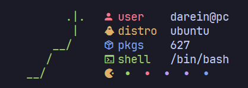

# pyfetch 🐍
A small Pyton script to showing basic system information and your favourite snake.



## Usage
> [!NOTE]  
> Requirements: ```Python 3.10.6``` or higger, <a href="https://www.nerdfonts.com/font-downloads">Nerd Fonts</a> and <a href="https://github.com/google/material-design-icons/blob/master/font/MaterialIcons-Regular.ttf">Material Icons</a>

```bash
git clone https://github.com/snomfake/pyfetch.git
cd pyfetch
python pyfetch.py
```
